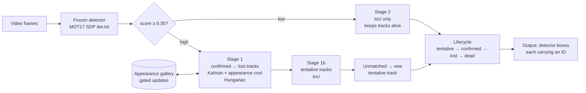
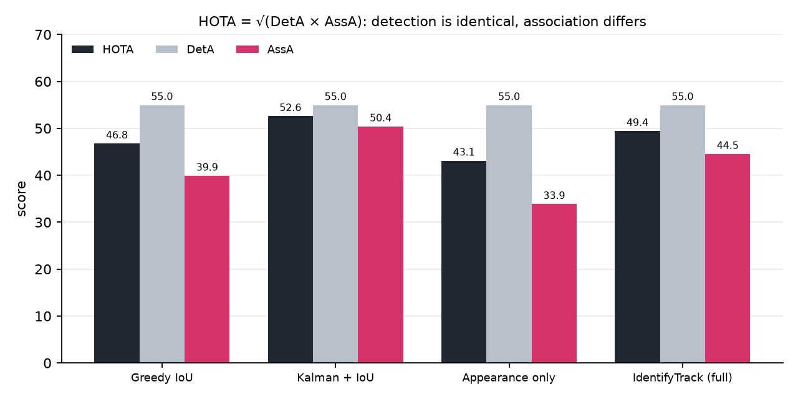
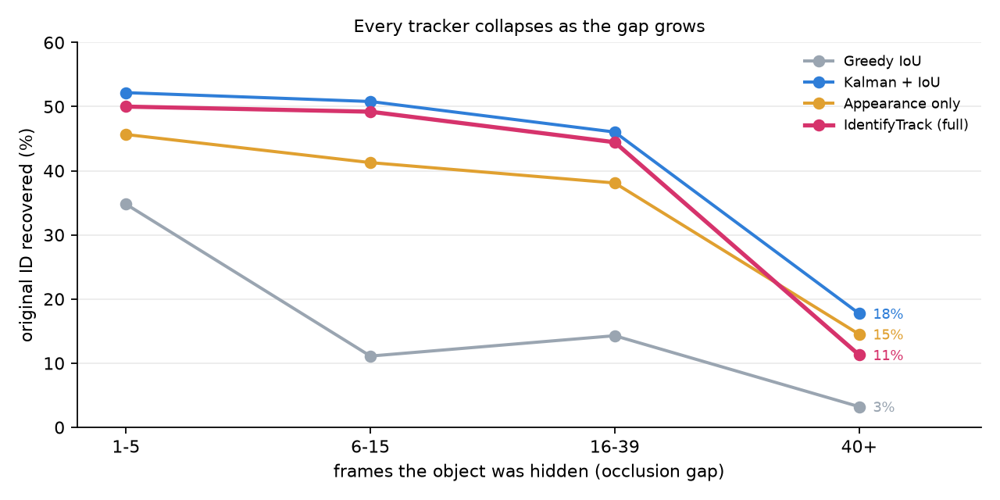
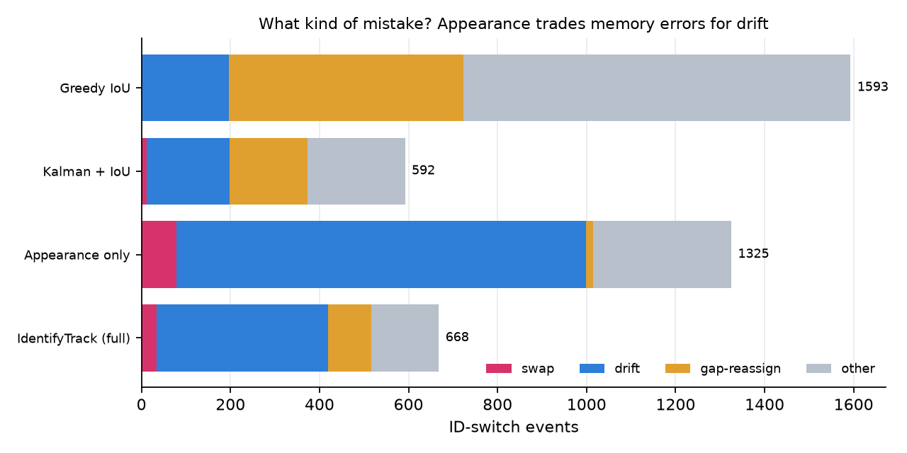
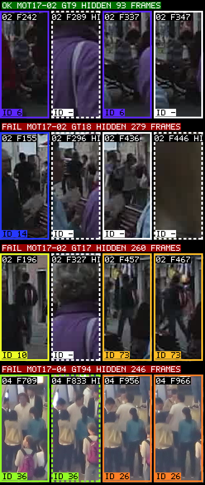

<div align="center">

# IdentifyTrack_AI

**Identity-preserving multi-object tracking under occlusion — and an honest way to measure it.**


-0b7285)


*When an object disappears behind something for two seconds, what does it take to give it back its
original identity — and how would you even measure whether you succeeded?*

[Result](#-the-honest-result) ·
[How it works](#-how-it-works) ·
[Metrics](#-why-hota-not-mota) ·
[Results](#-results) ·
[Quick start](#-quick-start) ·
[Project layout](#-project-layout) ·
[Limitations](#-limitations)

</div>

---

## Overview

IdentifyTrack_AI is a multi-object tracker whose job is **association, not detection**. The detector is
frozen and never touched, and the evaluation is built to separate two questions that most benchmarks blur:

| Question | Metric | Who is responsible |
|---|---|---|
| *Is there an object here?* | **DetA** | the detector |
| *Is this the same object I saw 40 frames ago?* | **AssA** | the tracker |

Everything in the tracking stack is written from scratch (Kalman filter, Hungarian assignment, HOTA,
IDF1, CLEAR-MOT). `scipy` is used only in one unit test, to check our own Hungarian solver.

## 🔎 The honest result

> **The full tracker does not beat a plain Kalman + IoU tracker.**
> Appearance memory, a lost-track buffer, gated gallery updates and two-stage matching together made
> things *slightly worse*, not better, on MOT17-02/04/09.

The comparison is clean because DetA is identical (55.0) for every variant, and the failure is
informative: the appearance memory traded *memory* failures (object returns with a new ID) for
*drift* failures (an old ID is wrongly handed to someone else).

| | Success criterion | Result |
|---|---|---|
| ❌ **MISSED** | HOTA ≥ 55 | **49.4** (DetA 55.0, AssA 44.5) |
| ❌ **MISSED** | Long-gap (40+) ID recovery ≥ 60%, and clearly above Kalman + IoU | **11.3 %** (7/62) vs Kalman + IoU **17.7 %** (11/62) |
| ❌ **MISSED** | ID switches ≥ 30 % below Kalman + IoU at equal DetA | **668 vs 592 — 12.8 % *more*** |
| ✅ PASS | DetA varies < 1 pt across all variants | spread **0.00** (55.0 everywhere; 74.1 on oracle boxes) |
| ✅ PASS | Oracle-detection run reported, AssA gap quantified | AssA oracle − real = **+24.8** pts |
| ✅ PASS | Own Hungarian equals scipy's total cost on 500 random matrices | **500/500**, incl. 461 rectangular, 121 with forbidden pairs |

Two facts limit how much blame the design deserves:

- With `lost_buffer = 100`, at most **36 of the 62** long-gap events are recoverable by construction
  (26 gaps are longer than 100 frames; median long gap = 84 frames ≈ 2.8 s, max 279). 36/62 = 58 % is
  below the 60 % target, so **the 60 % criterion was unreachable in the locked configuration**, whatever
  the appearance model did. Of the 36 reachable events the tracker recovered 7.
- In 14 of the 62 long gaps the detector never sees the person again, so nothing can be associated.
  These count as failures (strict definition) but are detection failures, not association failures.

---

## 🧠 How it works



| Component | File | What it does |
|---|---|---|
| Motion model | `tracker/kalman.py` | Kalman filter on the box; lost tracks keep *coasting* so they stay matchable |
| Assignment | `tracker/assignment.py` | Own Hungarian solver (verified against scipy on 500 matrices) |
| Cost | `tracker/cost.py` | Fuses Mahalanobis / IoU motion cost with appearance cost, with hard gates |
| Appearance gallery | `tracker/gallery.py` | Per-track feature memory; updates are **gated** (skipped when occluded or low confidence) to avoid poisoning |
| Lifecycle | `tracker/lifecycle.py` | `TENTATIVE → CONFIRMED → LOST → dead`, with a configurable lost buffer |
| Tracker loop | `tracker/tracker.py` | Two-stage, recency-cascaded matching (confirmed first, then lost) |

**Why a recency cascade?** A long-coasting track has an inflated covariance, which makes its
Mahalanobis distance small to *everything*. In a joint assignment it would steal detections from the
track that is actually following the person. Matching confirmed tracks first, then lost ones on what is
left, fixes that (found while debugging on MOT17-09).

**Emission contract.** Every tracker outputs **exactly the detector boxes with score ≥ `output_conf`
(0.30)**, raw, each carrying an ID. Trackers decide IDs, never which boxes exist. This is what makes DetA
identical by construction rather than by luck.

---

## 📏 Why HOTA, not MOTA

MOTA = 1 − (FN + FP + IDSW) / #GT is dominated by false positives and misses, that is, by the detector.
An identity switch costs exactly as much as one missed box, so a tracker can shred every identity in the
scene and still post a respectable MOTA.

A unit test (`tests/test_hota.py::test_mota_hides_identity_shredding`) builds exactly this: a perfectly
detected object given a new ID every 10 frames scores:

| Metric | Score |
|---|---|
| MOTA | **0.91** (looks great) |
| AssA | **0.10** |
| HOTA | **0.32** |

So the headline is **HOTA, always decomposed into DetA and AssA**; IDF1 sits next to it; MOTA appears only
as a legacy column marked as detector-dominated. A DetA spread ≥ 1 point between trackers is flagged
automatically (`eval.report.deta_warnings`) and never averaged away.

---

## 📊 Results

### Setup

| | |
|---|---|
| **Data** | MOT17-02, -04, -09 (static camera; 2 175 frames, 171 GT tracks). Moving-camera sequences excluded on purpose: no camera-motion compensation. |
| **Detector** | Frozen black box: MOT17's public SDP detections (`det.txt`), never trained or tuned. A YOLOv8 backend is implemented (`detection/frozen_detector.py`). |
| **Appearance** | Main runs: hand-made colour histogram (3 stripes, chromaticity + brightness, Hellinger-normalised). Extra: ImageNet ResNet18 (512-d). Neither is trained for person re-identification. |
| **Occlusion** | A GT box with **visibility < 0.25** counts as *hidden*; hidden stretches define the occlusion gaps. Locked before any result was seen. HOTA/IDF1 still use *all* GT boxes. |
| **Gap definition** | A reappearance is *recovered* iff the first matched pred ID after the gap equals the last matched pred ID before it. No prior ID → excluded (14). Never matched again → counted as **failure**. Bins: 1–5, 6–15, 16–39, **40+**. |

### Main comparison

DetA is constant because all trackers emit the same boxes.

| Method | HOTA | **DetA** | AssA | IDF1 | ID switches | Long-gap (40+) recovery | MOTA\* |
|---|---|---|---|---|---|---|---|
| Greedy IoU | 46.8 | **55.0** | 39.9 | 52.5 | 1593 | 3.2 % (2/62) | 60.6 |
| Kalman + IoU (SORT-equivalent) | **52.6** | **55.0** | **50.4** | **63.2** | **592** | **17.7 % (11/62)** | 62.0 |
| Appearance only | 43.1 | **55.0** | 33.9 | 48.1 | 1325 | 14.5 % (9/62) | 61.0 |
| **IdentifyTrack (full)** | 49.4 | **55.0** | 44.5 | 56.7 | 668 | 11.3 % (7/62) | 61.9 |

\* MOTA is a legacy column, dominated by the detector.



### The centrepiece: identity recovery by occlusion-gap length

Reappearances of a hidden object, and how many got their **original ID** back (recovered / total).



| Method | gap 1–5 | gap 6–15 | gap 16–39 | **gap 40+** |
|---|---|---|---|---|
| Greedy IoU | 16/46 (35 %) | 7/63 (11 %) | 9/63 (14 %) | 2/62 (3 %) |
| Kalman + IoU | 24/46 (52 %) | 32/63 (51 %) | 29/63 (46 %) | **11/62 (18 %)** |
| Appearance only | 21/46 (46 %) | 26/63 (41 %) | 24/63 (38 %) | 9/62 (15 %) |
| **IdentifyTrack (full)** | 23/46 (50 %) | 31/63 (49 %) | 28/63 (44 %) | 7/62 (11 %) |

Two things this table shows that HOTA hides. First, **every method collapses as the gap grows**: the best
tracker recovers about half the identities after a few frames and under a fifth after 40+. Second, the
failure is **not** uniform: greedy IoU has no memory and loses essentially everything beyond 5 frames,
while Kalman + IoU's motion prediction carries it through short and medium gaps but not past ~1.5 s.

### ID-switch taxonomy: what kind of mistake is it?

Every switch is classified automatically, in this order:

| Class | Meaning | Failure type |
|---|---|---|
| **swap** | two tracks exchange IDs | matching failure |
| **drift** | an ID that belonged to another object lands on this one (non-mutually) | motion-model failure |
| **gap-reassign** | object returned after occlusion with a stranger's new ID | **memory** failure |
| **other** | continuously visible, but its track died and a fresh ID started | lifetime failure |



| Method | swap | drift | gap-reassign | other | total |
|---|---|---|---|---|---|
| Greedy IoU | 0 | 196 | 527 | 870 | 1593 |
| Kalman + IoU | 12 | 186 | 175 | 219 | 592 |
| Appearance only | 79 | 920 | 16 | 310 | 1325 |
| IdentifyTrack (full) | 34 | 386 | 97 | 151 | 668 |

**Reading it:** greedy IoU fails on *memory* (527) and lifetime (870). Appearance-only has almost no
memory failures (16) but enormous drift (920): it remembers well and matches badly, because nothing ties
an ID to a place. **Full vs Kalman + IoU:** memory failures drop (175 → 97) and lifetime failures drop
(219 → 151), but drift **doubles** (186 → 386). Appearance memory turns "came back as a stranger" into
"was wrongly given someone else's old identity". With weak features the second error is as costly as the first.

<details>
<summary><b>Per-sequence results</b> (MOT17-09 was the development sequence, so 02 + 04 is the less biased number)</summary>

| Sequence | Kalman + IoU: HOTA / AssA / IDSW / 40+ | Full: HOTA / AssA / IDSW / 40+ |
|---|---|---|
| 02 | 30.9 / 27.0 / 372 / 6 of 39 | 30.0 / 25.3 / 363 / 4 of 39 |
| 04 | 60.0 / 56.8 / 172 / 5 of 17 | 56.5 / 50.3 / 262 / 3 of 17 |
| 09 (dev) | 48.2 / 42.7 / 48 / 0 of 6 | 42.1 / 32.5 / 43 / 0 of 6 |
| 02 + 04 | **52.9 / 51.0** / 544 / 11 of 56 | 50.0 / 45.5 / 625 / 7 of 56 |

</details>

<details>
<summary><b>Speed and fragmentation</b></summary>

| Method | Tracker-only speed (association only, 1 CPU core) | Distinct pred IDs per GT track (median / p90) |
|---|---|---|
| Greedy IoU | ≈ 14 000 fps | 7.0 / 26.3 |
| Kalman + IoU | ≈ 1 200 fps | 3.0 / 8.3 |
| Appearance only | ≈ 1 300 fps | 3.0 / 9.0 |
| Full | ≈ 390 fps | 3.0 / 9.0 |

Colour-histogram extraction ≈ 270 fps including JPEG decode of 1080p frames. Pure Python/numpy.

</details>

### Oracle: association with detection removed

Same trackers, but the detections are the ground-truth boxes (objects with visibility < 0.25 withheld, because a
detector cannot see through an occluder; without this the tracker would never lose anything). AssA is then pure
association quality. DetA is 74.1 for all four oracle runs and 55.0 for all four real runs.

| Method | AssA oracle | AssA real | Gap | HOTA oracle | IDSW oracle | 40+ oracle |
|---|---|---|---|---|---|---|
| Greedy IoU | 67.8 | 39.9 | +27.9 | 70.9 | 249 | 0/64 |
| Kalman + IoU | 79.8 | 50.4 | +29.3 | 76.9 | 63 | 24/64 (38 %) |
| Appearance only | 51.5 | 33.9 | +17.6 | 61.8 | 236 | 6/64 (9 %) |
| Full | 69.3 | 44.5 | **+24.8** | 71.7 | 99 | 20/64 (31 %) |

About **25 AssA points** of the tracker's error are the detector's fault, not association's (29 for Kalman + IoU).
But even with perfect boxes, Kalman + IoU (AssA 79.8, 38 % long-gap) beats the full tracker (69.3, 31 %).

### Ablations and sweeps

<details>
<summary><b>(a) Gallery update policy</b>: gating cut swaps by a third, but barely moved anything else</summary>

| Gallery policy | swap | drift | gap-reassign | other | total | HOTA | 40+ recovery |
|---|---|---|---|---|---|---|---|
| always update (naive) | 51 | 395 | 88 | 145 | 679 | 49.2 | 10/62 (16 %) |
| **occlusion-gated** | **34** | 386 | 97 | 151 | 668 | 49.4 | 7/62 (11 %) |

</details>

<details>
<summary><b>(b) Lost-buffer length</b>: frames a lost track keeps coasting and stays matchable</summary>

| lost_buffer | HOTA | AssA | IDF1 | ID switches | 40+ recovery |
|---|---|---|---|---|---|
| 0 | 47.3 | 40.8 | 53.5 | 1609 | 2/62 (3 %) |
| 10 | 50.6 | 46.6 | 59.2 | 832 | 7/62 (11 %) |
| 30 | **51.0** | **47.3** | **60.2** | 695 | 10/62 (16 %) |
| 60 | 50.4 | 46.3 | 59.1 | 680 | 10/62 (16 %) |
| **100** (locked) | 49.4 | 44.5 | 56.7 | 668 | 7/62 (11 %) |
| 200 | 48.9 | 43.6 | 56.3 | 660 | 6/62 (10 %) |

</details>

<details>
<summary><b>(c) Motion weight</b>: 1 = motion only, 0 = appearance only among feasible pairs</summary>

| lambda_motion | HOTA | AssA | ID switches | 40+ recovery |
|---|---|---|---|---|
| 0.0 | **51.2** | **47.7** | 713 | 9/62 (15 %) |
| 0.25 | 50.1 | 45.6 | **617** | 10/62 (16 %) |
| **0.5** (locked) | 49.4 | 44.5 | 668 | 7/62 (11 %) |
| 0.75 | 48.7 | 43.2 | 723 | 9/62 (15 %) |
| 1.0 | 48.4 | 42.8 | 800 | 9/62 (15 %) |

</details>

<details>
<summary><b>(e) Appearance on or off</b></summary>

| Variant | HOTA | AssA | ID switches | 40+ recovery |
|---|---|---|---|---|
| motion only | 48.6 | 43.0 | 806 | 8/62 (13 %) |
| **motion + appearance** | 49.4 | 44.5 | 668 | 7/62 (11 %) |

</details>

<details>
<summary><b>(f) Appearance features</b>: <code>app_gate</code> re-calibrated per backend with the same rule (p99 of same-identity cosine distance)</summary>

| Features | AUC same < diff | app_gate | Appearance-only HOTA | Full HOTA | Full 40+ |
|---|---|---|---|---|---|
| Colour histogram | 0.83 | 0.30 | 43.1 | 49.4 | 7/62 (11 %) |
| ImageNet ResNet18 | 0.87 | 0.38 | 46.6 | 49.8 | 8/62 (13 %) |

</details>

**Which knob mattered?** Ranked by HOTA range:

| Rank | Knob | HOTA range | Note |
|---|---|---|---|
| 1 | **Lost buffer** | 3.7 pts | 1609 → ~660 switches, by far the most consequential |
| 2 | Motion weight | 2.8 pts | |
| 3 | Appearance on/off | 0.8 pts | |
| 4 | Better ReID features | 0.4 pts (full) / 3.5 pts (appearance-only) | |
| 5 | **Gallery update policy** | 0.2 pts | moved long-gap recovery in the *wrong* direction |

The design decision called the most important in the original brief is, empirically, nearly irrelevant
here. Two caveats: with MOT17's saturated detector scores the confidence half of the gate is almost always
true (only the overlap half does anything), and with weak features there is little signal for a clean
gallery to protect.

The sweeps also show the locked defaults were not optimal (buffer 30 and lambda 0 each give HOTA ≈ 51).
They were **not** re-locked after seeing this, because choosing the best setting on the evaluation data
would be tuning to the test. Even the best single setting (51.2) is below Kalman + IoU (52.6).

---

## 🖼️ Qualitative examples



`figures/qualitative.png`: the longest successful long-gap re-identification and the three longest failures
of the full tracker (selection rule fixed in advance in `scripts/make_figures.py`, not cherry-picked).
Columns: last matched frame before the gap → mid-gap (object hidden, GT position dashed) → first matched
frame after → 10 frames later. Border colour and number = predicted ID.

| Row | Sequence / GT id | Hidden for | Frames shown | Outcome |
|---|---|---|---|---|
| ✅ success | MOT17-02, GT 9 | 93 frames (243–335) | 242, 289, 337, 347 | **ID 6 → ID 6** |
| ❌ failure | MOT17-02, GT 18 | 279 frames (157–435) | 155, 296, 436, 446 | ID 14 → **no box ever again** (detector) |
| ❌ failure | MOT17-02, GT 17 | 260 frames (197–456) | 196, 327, 457, 467 | ID 10 → **ID 73** |
| ❌ failure | MOT17-04, GT 94 | 246 frames (710–955) | 709, 833, 956, 966 | ID 36 → **ID 26** |

The three failures hid the object for 246–279 frames, beyond the 100-frame buffer, so they were
unrecoverable by construction regardless of appearance (in the first, the detector never finds the person
again). The one success (93 frames) is inside the buffer. Nothing here shows the tracker *could* have
recovered the failures.

Side-by-side videos (greedy IoU vs Kalman + IoU, oracle detections, white frame = the followed object):
[`MOT17-09_success_gt10.mp4`](figures/MOT17-09_success_gt10.mp4) ·
[`MOT17-09_failure_gt7.mp4`](figures/MOT17-09_failure_gt7.mp4)

---

## 🚀 Quick start

```bash
# 1. Create a virtual environment and install the core dependencies
python3 -m venv .venv
.venv/bin/pip install numpy scipy pytest pyyaml      # scipy: tests only
.venv/bin/pip install torch torchvision              # optional: only for the ResNet18 experiment

# 2. Download MOT17-02/04/09 (HTTP Range requests, needs curl)
.venv/bin/python -m scripts.fetch_data
.venv/bin/python -m scripts.fetch_dets

# 3. Run everything: tests → main table → sweeps → figure → criteria check
.venv/bin/python -m scripts.reproduce
```

`scripts.reproduce` runs the unit tests, recomputes every table above, regenerates the qualitative figure
and writes `results/main.json`, `results/sweeps.json` and `results/criteria.md` (the pass/miss table is
computed, never hand-edited). The whole pipeline is deterministic: the main comparison was run twice with
identical results to the last digit. `ffmpeg` is used for frame decoding and video encoding.

### Useful commands

| Goal | Command |
|---|---|
| Evaluate all methods | `python -m scripts.evaluate` |
| Evaluate with oracle detections | `python -m scripts.evaluate --oracle` |
| Use ResNet18 appearance features | `python -m scripts.evaluate --reid resnet18` |
| Run one tracker | `python -m scripts.track --method ours` |
| Render comparison videos | `python -m scripts.render_video` |
| Redraw the README charts | `python -m scripts.make_readme_figures` |
| Run unit tests only | `python -m pytest -q` |

### Configuration

Everything is controlled by [`config.yaml`](config.yaml). Values marked `LOCKED` were fixed **before any
result was seen** and must not be tuned against the evaluation sequences.

| Key | Default | Meaning |
|---|---|---|
| `output_conf` | 0.30 | LOCKED. Every tracker emits exactly the detections ≥ this (keeps DetA fixed) |
| `data.min_visibility` | 0.25 | LOCKED. GT boxes below this count as occluded |
| `tracker.lost_buffer` | 100 | Frames a lost track keeps coasting |
| `tracker.lambda_motion` | 0.5 | Motion vs appearance weight |
| `tracker.app_gate` | 0.30 | Max cosine distance for a pair to be possible |
| `tracker.gallery_policy` | `gated` | `gated` or `always` |
| `reid.backend` | `color_hist` | `color_hist` (no torch) or `resnet18` |

---

## 🗂️ Project layout

```
IdentifyTrack_AI/
├── tracker/      kalman.py · assignment.py (own Hungarian) · cost.py · gallery.py · lifecycle.py · tracker.py
├── baselines/    greedy_iou.py · kalman_iou.py · appearance_only.py
├── eval/         hota.py · idf1.py · clear.py · gaps.py · taxonomy.py · oracle.py · report.py · mot_io.py · common.py
├── detection/    frozen_detector.py · reid.py · types.py
├── scripts/      fetch_data · fetch_dets · evaluate · sweep · reproduce · track · calibrate · make_figures · render_video · make_readme_figures
├── tests/        assignment (500 vs scipy) · kalman · hota · gaps · taxonomy · baselines · tracker · tracker_parts
├── figures/      charts, qualitative grid, comparison videos
├── results/      main.json · sweeps.json · per_sequence.txt · yolo_*.json
└── config.yaml   single source of truth for every run
```

`eval/clear.py` (CLEAR matching shared by MOTA, gaps and taxonomy so all switch counts agree by
construction), `eval/mot_io.py` and `eval/common.py` were not in the original plan but are needed.
Forbidden-dependency rule respected: no `motmetrics`, `TrackEval`, `filterpy`, `deep_sort_realtime` or
`boxmot`; scipy appears only in `tests/test_assignment.py`.

---

## ⚠️ Limitations

| Area | Limitation |
|---|---|
| **Sample size** | Three static-camera pedestrian sequences; 62 long-gap events. One event is 1.6 percentage points, so the 40+ rates are noisy. No confidence intervals were computed. |
| **No held-out sequence** | `app_gate`, the Mahalanobis gates and the tracker structure were chosen while looking at these sequences' GT (MOT17-09 especially). The design changed four times while debugging on MOT17-09, so 09 is not a fair test. |
| **Unreachable target** | The 60 % criterion was unreachable as configured (58 % ceiling at `lost_buffer=100`). The buffer was not changed to make it reachable. |
| **Detector caveat** | The "frozen detector" is MOT17's public SDP output, not a model run here. It is pre-thresholded at 0.4 with saturated scores (median 1.0), so the low-confidence second stage is **inert** in every reported number and `gallery_update_conf` barely filters. SDP may have been trained on MOT data (could not be verified). DetA (55.0) is bounded by it. |
| **Weak appearance** | Colour histograms and ImageNet features, no ReID fine-tuning (AUC 0.83 / 0.87). A real person-ReID model is the obvious next experiment and could change the picture. |
| **No camera motion compensation** | Hence static-camera sequences only. |
| **Strict gap metric** | "Never re-acquired" counts as failure, even when the detector never finds the person again (14 of 62 long gaps). Any GT-hidden stretch is a gap, so a person leaving and re-entering the frame looks the same. |
| **Not the official toolkit** | MOT17 distractor classes are not used to forgive false positives, and HOTA is our own implementation of the paper's definition. Absolute numbers are not comparable with the leaderboard. |
| **Offline only** | Runtime is not optimised (FPS above is association only). |
| **Single seed** | The pipeline is deterministic, so there is no seed variance, but also no error bars. |

---

## 🔭 Next steps

- [ ] Replace colour histograms with a real person-ReID model (the clearest lever on AssA)
- [ ] Hold out a sequence for calibration so `app_gate` is not tuned on the evaluated identities
- [ ] Add bootstrap confidence intervals to the 40+ recovery rate
- [ ] Add camera-motion compensation and evaluate on moving-camera sequences
- [ ] Cross-check HOTA against the official TrackEval numbers

---

## 📄 License

Released under the [MIT License](LICENSE). MOT17 data and its public detections are **not** covered by
this license; they keep their own terms from the [MOTChallenge](https://motchallenge.net/) authors.

---

<div align="center">

*Negative results, reported honestly, are still results.*

</div>
